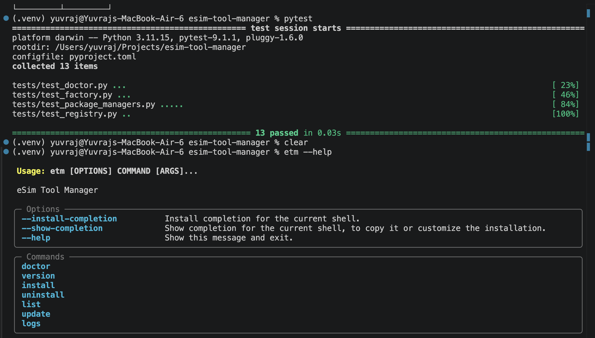
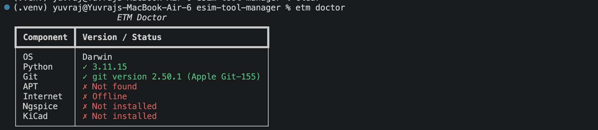
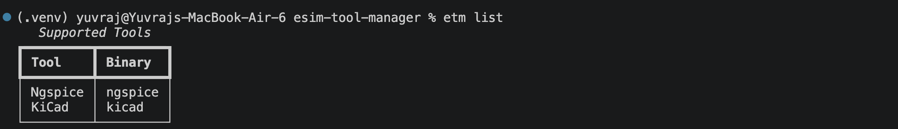
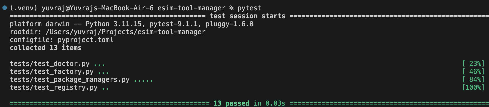

# eSim Tool Manager (ETM)

`etm` is a small CLI tool written in Python to manage external software dependencies for the eSim open-source EDA suite. It tracks required simulation binaries in a YAML configuration, runs basic health checks on your system, and delegates installation and update tasks directly to native Linux package managers.

---

## Why I built this

If you've spent time working with eSim, you know setting up the environment on a new machine gets annoying fast. Every time I set up a fresh Linux install or helped someone else configure eSim, I found myself going through the exact same tedious steps: trying to remember whether the package was named `ngspice` or `ngspice-circuit`, manually checking if `ghdl` was already in my `$PATH`, running `which` over and over, and reading through messy terminal output to figure out why a tool wasn't launching.

Eventually, I got tired of re-running the same handful of `apt` commands and checking binary paths by hand. I wanted a single command I could run in my terminal that would inspect my environment, tell me exactly which simulation tools were missing, and install them without me having to remember every specific package name.

I didn't need a complex system or a shiny desktop app. I just wanted a simple tool that remembered eSim's dependencies so I didn't have to. That's why I built `etm`.

---

## What ETM does

At its core, `etm` acts as a thin wrapper between eSim's tooling requirements and your system's package manager.

Instead of hardcoding package names into custom shell scripts, `etm` reads tool definitions from a clean YAML file inside the repository. When you run `etm install ngspice`, it looks up `ngspice` in that registry, figures out what operating system you're on, sends the install command to `apt`, and gives you clear status updates in your terminal.

If you happen to run `etm` on macOS or Windows while developing, it won't crash with a giant traceback or try to run `apt` commands that don't exist. Instead, it catches the unsupported OS at startup, switches to a dummy backend, and tells you what happened.

---

## What this project isn't

It's worth being clear about what `etm` isn't trying to be.

`etm` isn't a replacement for `apt`, `dnf`, or any other Linux package manager. It doesn't handle building packages from source, managing custom repositories, or resolving complex system-level library conflicts. Trying to build a custom package manager from scratch for a specific EDA tool suite would have been massive scope creep, and honestly, a waste of time.

I intentionally kept `etm` focused on a small, well-defined problem: tracking eSim's specific dependencies and giving you a simple CLI interface to manage them. Keeping the scope tight meant I could finish a reliable tool rather than abandoning a half-built package manager weeks later.

---

## Features

* **Centralized Registry**: Keeps tool definitions, display labels, and binary names in a single `tools.yaml` file.
* **OS-Aware Execution**: Checks your operating system at runtime and safely routes package commands.
* **System Diagnostics**: Includes an `etm doctor` command to check if your OS and package manager are ready.
* **Formatted Terminal Tables**: Renders tool status, binary presence, and detected versions using Rich tables.
* **Safe Fallback Backend**: Uses a `DummyPackageManager` on unsupported OS environments to prevent broken shell executions.
* **Runtime Event Logging**: Logs application activity to standard Python logging handlers for easier troubleshooting.

---

## Installation

You can clone the repository and install `etm` locally using Python's editable mode.

### Prerequisites

* Python 3.11 or higher
* Linux (Debian or Ubuntu recommended for native `apt` execution)

### Steps

```bash
git clone https://github.com/csyuvraj/esim-tool-manager.git
cd esim-tool-manager

python3 -m venv .venv
source .venv/bin/activate

pip install -e ".[dev]"
```

Once installed, check that the binary is available in your shell:

```bash
etm --help
```

---

## Quick Start

Here's the standard workflow when using `etm` for the first time:

```bash
# 1. Run environment diagnostics to make sure your system is ready
etm doctor

# 2. List all registered tools and see what's currently installed
etm list

# 3. Install a missing tool from the registry
etm install ngspice

# 4. Refresh your package manager indices
etm update

# 5. Inspect runtime execution logs
etm logs
```

---

## Example Session

Here's a quick look at what running `etm` looks like in a terminal:

```text
$ etm doctor
[+] Checking system platform... Linux (Ubuntu 22.04 LTS)
[+] Checking package manager... apt found (/usr/bin/apt)
[+] Diagnostic result: System fully supported.

$ etm list
┌───────────┬──────────────┬──────────────┬───────────────┬───────────┐
│ Tool Name │ Display Name │ Binary       │ Status        │ Version   │
├───────────┼──────────────┼──────────────┼───────────────┼───────────┤
│ ngspice   │ Ngspice      │ ngspice      │ Installed     │ ngspice-36│
│ kicad     │ KiCad        │ kicad        │ Not Installed │ -         │
│ ghdl      │ GHDL         │ ghdl         │ Not Installed │ -         │
└───────────┴──────────────┴──────────────┴───────────────┴───────────┘

$ etm install ngspice
[*] Looking up 'ngspice' in registry... Found.
[*] Dispatching install to AptManager...
[+] Running: sudo apt install -y ngspice
[+] Success: Installed Ngspice successfully.

$ etm logs -n 5
2026-08-08 18:00:12 [INFO] Executing doctor check.
2026-08-08 18:00:25 [INFO] Tool registry loaded 3 tools from tools.yaml.
2026-08-08 18:00:40 [INFO] Executing install for tool: ngspice
2026-08-08 18:00:43 [INFO] AptManager install completed successfully.
```

---


---

## Screenshots

Below are visual previews of  in action. Replace the placeholder paths below with your actual uploaded image URLs once captured.

<p align="center">
  <br/>
  <em><code>etm --help</code> — CLI options and available command routes</em>
</p>

<br/>

<p align="center">
  <br/>
  <em><code>etm doctor</code> — System platform and package manager environment checks</em>
</p>

<br/>

<p align="center">
  <br/>
  <em><code>etm list</code> — Registered tools, installation status, and detected versions</em>
</p>

<br/>

<p align="center">
  <br/>
  <em><code>pytest</code> — Full test suite passing with mocked subprocess execution</em>
</p>

## Project Layout

Here's how the codebase is structured and why each directory is set up the way it is:

```text
esim-tool-manager/
├── .github/                # CI workflows and community health templates
│   └── workflows/
│       └── ci.yml          # GitHub Actions workflow for testing
├── tests/                  # Unit tests covering core logic
│   ├── test_doctor.py      # Diagnostic command tests
│   ├── test_factory.py     # Platform routing tests
│   ├── test_package_managers.py # AptManager and DummyManager tests
│   └── test_registry.py    # YAML loading and dataclass tests
├── tool_manager/           # Main Python package
│   ├── data/
│   │   └── tools.yaml      # Config file listing registered tools
│   ├── models/             # Data containers
│   │   ├── registry.py     # Registry loading logic
│   │   ├── result.py       # InstallResult dataclass
│   │   ├── status.py       # Tool status representation
│   │   └── tool.py         # Tool dataclass model
│   ├── package_managers/   # OS execution logic
│   │   ├── apt.py          # Linux apt implementation
│   │   ├── base.py         # PackageManager abstract base class
│   │   └── factory.py      # Factory router & DummyPackageManager
│   ├── cli.py              # Typer CLI routes and UI handlers
│   ├── config.py           # Default paths and configurations
│   ├── doctor.py           # System diagnostic runner
│   ├── exceptions.py       # Custom application exceptions
│   ├── install.py          # Tool installation runner
│   ├── list_tools.py       # Status checking for registered tools
│   ├── logger.py           # Logging setup and formatting
│   ├── logs.py             # Log display helper
│   ├── main.py             # CLI entry point wrapper
│   ├── uninstall.py        # Tool removal runner
│   ├── update.py           # System index update runner
│   └── version.py          # Version display logic
├── pyproject.toml          # Packaging metadata and dependency definitions
└── requirements.txt        # Lockfile reference for environment setup
```

---

## Design Decisions

When setting up the project architecture, I made a few choices worth explaining if you're looking through the code:

* **Why Typer?** Writing standard `argparse` code gets verbose fast. Typer let me define commands using plain Python functions and type hints. It automatically handles option parsing, generates `--help` pages, and keeps the CLI code readable.
* **Why Rich?** Plain terminal output is fine, but formatting tool availability with tables and clean colors makes the CLI far easier to skim. Rich handles table layouts, borders, and colors cleanly without requiring manual string formatting.
* **Why `tools.yaml`?** Hardcoding tool names, binary locations, and descriptions directly into Python classes makes adding new tools annoying. Moving definitions into a single YAML file means adding support for a new tool is just adding four lines of YAML—no code edits needed.
* **Why the Factory Pattern?** Instead of calling `subprocess.run(["apt", ...])` directly inside CLI commands, all package management logic is isolated behind a `PackageManager` interface. `PackageManagerFactory` looks at `platform.system()` at runtime and hands back the right manager instance. This keeps system-specific shell calls entirely separate from CLI routing logic.
* **Why `DummyPackageManager`?** Since I do a lot of my development on macOS, running commands that expect `apt` would usually crash with missing binary errors. `DummyPackageManager` implements the exact same interface as `AptManager`, but safely returns a message explaining that operations aren't supported on the current OS. It made local development and testing much smoother without needing to spin up a Linux VM every time I touched the code.

---

## Supported Platforms

| Platform | Backend Manager | Status | Notes |
| :--- | :--- | :--- | :--- |
| **Linux (Debian/Ubuntu)** | `AptManager` | Supported | Primary target environment. Runs `sudo apt`. |
| **macOS** | `DummyPackageManager` | Safe Fallback | Commands run safely and report OS as unsupported. |
| **Windows** | `DummyPackageManager` | Safe Fallback | Commands run safely and report OS as unsupported. |
| **Linux (Fedora/Arch)** | `DnfManager` / `PacmanManager` | Planned | Architecture is ready for new backend additions. |

---

## Testing

The project uses `pytest` for unit testing. To ensure tests run safely on any machine, the test suite mocks `subprocess` calls and `shutil.which` checks so it never makes actual changes to your system packages during a test run.

You can run the full test suite locally with:

```bash
python3 -m pytest tests/ -v
```

CI is handled via GitHub Actions in `.github/workflows/ci.yml`. On every push and pull request, it sets up a fresh Python 3.11 environment on Ubuntu and runs the full test suite.

---

## Things I'd improve

Looking at `v1.0.0` with fresh eyes, there are definitely a few areas I'd refactor or expand if I kept building on this:

* **User Config Directory**: Right now, `tools.yaml` lives inside the installed Python package directory. I'd like to update `ToolRegistry` to check `~/.config/etm/tools.yaml` first, so users can add custom tool definitions without editing the package source.
* **Distro-Specific Package Names**: Some Linux distributions name packages slightly differently (e.g., `ngspice` vs `ngspice-doc`). Adding package name overrides inside `tools.yaml` per package manager would make multi-distro support much cleaner.
* **Granular Installation Progress**: Since `apt` runs via `subprocess.run`, `etm` currently waits for the subprocess to exit before showing the result. Piping stdout directly to terminal streams or a progress bar would give better feedback during long installs.

---

## Contributing

Contributions are always welcome. Whether you want to fix a bug, add a new tool definition to `tools.yaml`, or add support for another Linux package manager, feel free to submit a pull request.

1. Fork the repository and create a branch (`git checkout -b feature/my-changes`).
2. Make your changes and make sure tests pass (`python3 -m pytest tests/`).
3. Open a Pull Request with a brief explanation of what you changed.

Take a look at `CONTRIBUTING.md` for a quick setup guide.

---

## Future Work

* [ ] Add `dnf` package manager support for Fedora/RHEL.
* [ ] Add `pacman` package manager support for Arch Linux.
* [ ] Support loading custom tool registries from `~/.config/etm/`.
* [ ] Add shell autocompletion setup commands for `bash` and `zsh`.

---

## Lessons Learned

Building `etm` was a really practical project for working through standard Python packaging and CLI design pattern practices. 

When I started, I had most of the logic in a couple of loose scripts. Refactoring that into a clean, testable package taught me a lot about structuring Python projects properly. Moving configuration out of code and into `tools.yaml` made the system far more extensible, while setting up abstract package manager interfaces proved how useful design patterns can be when building CLI tools for multiple operating systems.

It was also my first time using Typer and Rich together on a real project. Once you get used to declaring CLI commands with type hints and rendering data using Rich tables, going back to hand-crafted `argparse` setups feels completely unnecessary.

---

## Author

**Yuvraj Singh**

I built `etm` as a personal project while working with eSim to make dependency setup easier and learn more about Python packaging, design patterns, and CLI development. 

If you're using eSim and find this tool helpful, or if you have ideas for improving it, feel free to open an issue or start a discussion on GitHub. Feedback and pull requests are always welcome!
